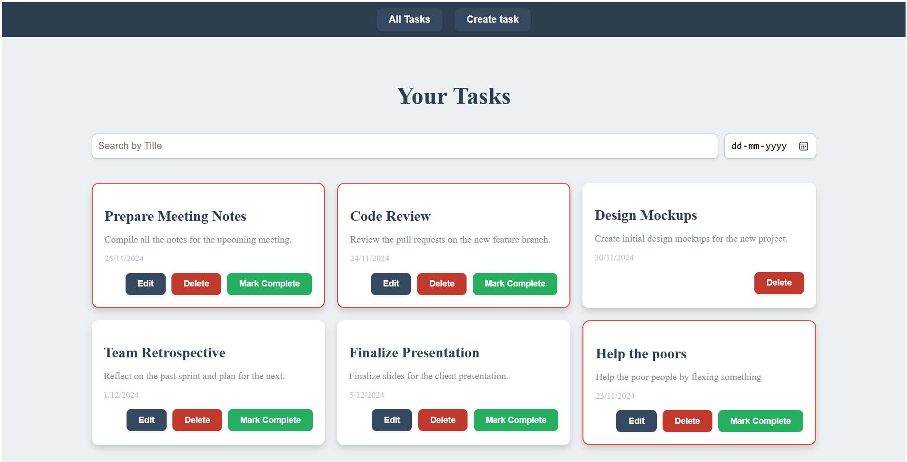
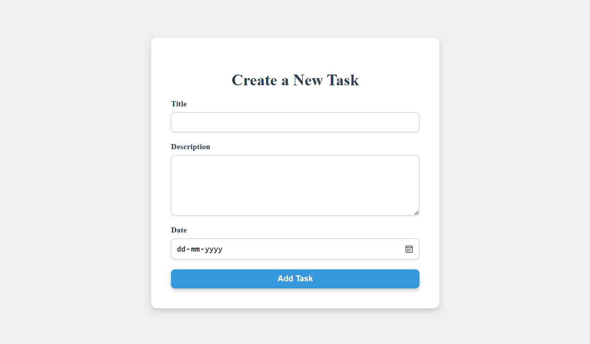

# To-Do App

A feature-rich, task management application built using the **MERN stack (MongoDB, Express, React, Node.js)**. The app includes functionalities like task creation, editing, completion tracking, filtering, and deletion, all with a sleek and consistent UI.

## Features

* **Task Management**: Add, edit, delete, and mark tasks as completed.
* **Filtering**: Search tasks by title and filter by date.
* **Visual Indication**: Tasks due within 2 days are highlighted with a red border.
* **Animations**: Smooth UI transitions using `framer-motion`.
* **Dynamic Routing**: Edit and delete routes for seamless updates.
* **Loading Indicators**: Show loaders while fetching data from the backend.
* **Responsive Design**: Mobile and desktop-friendly UI.
* **Consistent Styling**: Lavish and modern design maintained across all components.

## Tech Stack

* **Frontend**: React, Framer Motion
* **Backend**: Node.js, Express
* **Database**: MongoDB
* **State Management**: React Hooks
* **Styling**: CSS-in-JS (Inline styles)

## Folder Structure

to_do_app/
  .gitignore
  eslint.config.js
  index.html
  README.md
  vite.config.js
  
  backend/

    .env
    seed.js
    server.js
    controllers/
      taskController.js
    models/
      taskModel.js
    routes/
      taskRoutes.js

  public/

    vite.svg

  src/

    App.jsx
    main.jsx
    components/
      CreateTasks.jsx
      HeroSection.jsx
      Home.jsx
      Navbar.jsx
      UpdateTasks.jsx

## Installation

### Prerequisites

Ensure you have the following installed:

* Node.js (v14 or above)
* MongoDB (running locally or via cloud service)

### Steps

1. **Clone the Repository**

   ```bash
   git clone https://github.com/your-username/to-do-app.git
   cd to-do-app

### Install Dependencies

cd ..
npm install
* **Set Up Environment Variables (if applicable)**
In the backend folder, create a .env file to store your MongoDB connection URL:
MONGODB_URI=mongodb://localhost:27017/todoapp
PORT=5000

### Start the Application

* **You can start both the backend and frontend using the following command:**
npm run dev

Alternatively, start them separately:

* **For the Backend:**
npm run start-backend

* **For the Frontend:**
npm run start-frontend

### Backend API Routes

Endpoint	       Method	  Description
/tasks	             GET	  Fetch all tasks
/tasks	             POST	  Create a new task
/tasks/:id	         GET	  Fetch a specific task by ID
/tasks/:id	         PUT	  Update a task by ID
/tasks/:id	         DELETE	  Delete a task by ID
/tasks/complete/:id	 PUT	  Mark a task as completed

### Frontend Components

1. **HeroSection.js****
Displays all tasks with search and date filter functionality.
Allows editing, deleting, and marking tasks as complete.

2. **CreateTasks.js**
Form to create new tasks.

3. **UpdateTasks.js**
Form to update existing tasks.

### Scripts

npm run dev: Start both the backend and frontend concurrently.
npm run start-backend: Start the backend server.
npm run start-frontend: Start the frontend server.

### Additional Notes

MongoDB: If using a local MongoDB instance, ensure it's running before starting the backend server.
Frontend API URL: The frontend is set to interact with the backend at http://localhost:5000 by default. Make sure the backend is running on this port.
To initialize the database, use the **seed.js** file included in the backend folder. It will create the database with basic entries


## Snapshots of UI:


